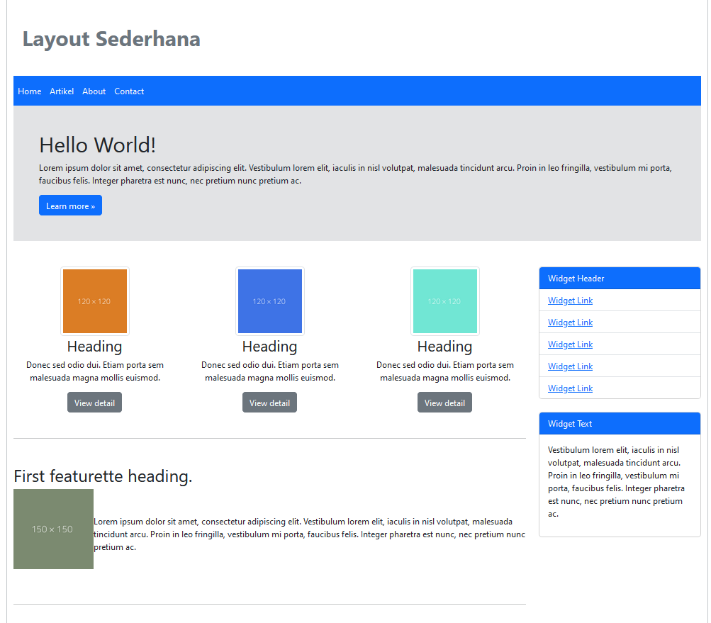

# Lab6web
# Paraktikum 6
Instruksi Praktikum
1. Persiapkan text editor misalnya VSCode.
2. Buat folder baru dengan nama lab6_css_framework
3. Buat file baru dokumen html
4. Buat struktur dasar dari dokumen HTML.
5. Buatlah layout web sederhana menggunakan css frameword (Twitter Bootsrtap).
6. Lakukan validasi dokumen html dengan mengakses http://validator.w3.org
Berdasarkan gambar layout web berikut, buatlah menggunakan Twitter Bootstrap.

## Codingan HTML dengan Bootstrap

## Output

